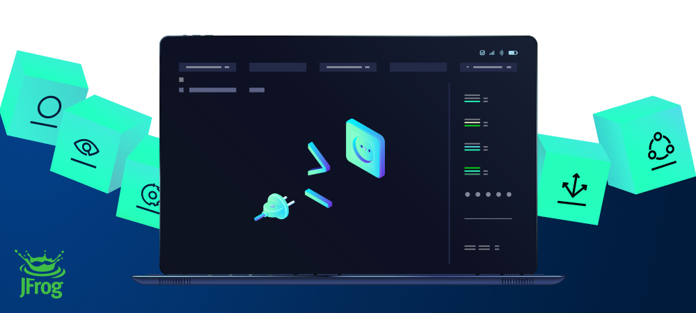

# JFrog CLI Plugins Registry

## General
**JFrog CLI Plugins** allow enhancing the functionality of [JFrog CLI](https://www.jfrog.com/confluence/display/CLI/JFrog+CLI) to meet the specific user and organization needs. The source code of a plugin is maintained as an open source Go project on GitHub. All public plugins are registered in **JFrog CLI's Plugins Registry**. The Registry is hosted in this GitHub repository. The [plugins](plugins) directory includes a descriptor file for each plugin included in the Registry. 

## Installing a plugin 
After a plugin is included in this Registry, it becomes available for installation using JFrog CLI. JFrog CLI version 1.41.1 or above is required. To install a plugin included in this registry, run the following JFrog CLI command -  `jf plugin install plugin-name`. 

## Available plugins
### Security plugins
<table>
    <tr>
        <td width="20%">
            <a href="https://github.com/jfrog/log4j-tools/tree/main/env_verify/jfrog_cli_plugin#readme">env-verify<a>
        </td>
        <td>
            This plugin checks whether the Java environment and command line options of your log4j-enabled Java application, allow for the exploitation of CVE-2021-44228.
        </td>
    </tr>
    <tr>
        <td width="20%">
            <a href="https://github.com/jfrog/log4j-tools/tree/main/scan_cve_2021_45046_config/jfrog_cli_plugin#readme">scan-cve-2021-45046-config</a>
        </td>
        <td>
            This plugin scans a root-folder and all the archive files in it, looking for probable log4j configuration files. Inside each archive, the plugin looks for configuration options which may enable an attacker to exploit CVE-2021-45046.
        </td>
    </tr>
    <tr>
        <td width="20%">
            <a href="https://github.com/jfrog/log4j-tools/tree/main/scan_log4j_calls_jar/jfrog_cli_plugin#readme">scan-log4j-calls-jar</a>
        </td>
        <td>
            This plugin recursively scans all <i>.jar</i> files in a root-folder. For each jar file, the plugin prints out the locations (class name and method name) of calls to <i>info/warn/error/log/debug/trace/fatal</i> methods of <i>log4j2.Logger</i>. 
        </td>
    </tr>
    <tr>
        <td width="20%">
            <a href="https://github.com/jfrog/log4j-tools/tree/main/scan_log4j_calls_src/jfrog_cli_plugin#readme">scan-log4j-calls-src</a>
        </td>
        <td>
            This plugin recursively scans all <i>.java</i> files in a root-folder. For each file, the plugin prints out the locations (file name and corresponding code lines) of calls to <i>log4j2</i> logging methods. 
        </td>
    </tr>
     <tr>
        <td width="20%">
            <a href="https://github.com/jfrog/log4j-tools/tree/main/scan_log4j_versions/jfrog_cli_plugin#readme">scan-log4j-versions</a>
        </td>
        <td>
            This plugin recursively scans a root folder for <i>.jar</i> and <i>.war</i> files. For every file that is detected, the plugin looks for <i>log4j/core/net/JndiManager.class</i> and <i>log4j/core/lookup/JndiLookup.class</i>.
        </td>
    </tr>
</table>

### General plugins
<table>
    <tr>
        <td width="20%">
            <a href="https://github.com/tamirdavid/benchmark">benchmark</a>
        </td>
        <td>
            This plugin is for measuring upload and download speeds to and from an Artifactory instance.
        </td>
    </tr>
    <tr>
        <td width="20%">
            <a href="https://github.com/jfrog/jfrog-cli-plugins/tree/main/build-deps-info#readme">build-deps-info</a>
        </td>
        <td>
            The build-deps-info plugin prints the dependencies' details of a specific build, which has been previously published to Artifactory.
        </td>
    </tr>
    <tr>
        <td width="20%">
            <a href="https://github.com/jfrog/jfrog-cli-plugins/tree/main/build-report#readme">build-report</a>
        </td>
        <td>
            This JFrog CLI plugin prints a report of a published build info in Artifactory, or the diff between two builds.
        </td>
    </tr>
    <tr>
        <td width="20%">
            <a href="https://github.com/rdar-lab/cve-impact-check#readme">cve-impact-check</a>
        </td>
        <td>
            This plugin allows checking via Xray if there are any impacted artifacts on a specific env/jfrog platform. It requires the artifacts to be already indexed by Xray.
        </td>
    </tr>
    <tr>
        <td width="20%">
            <a href="https://github.com/jfrog/jfrog-cli-plugins/tree/main/file-spec-gen#readme">file-spec-gen</a>
        </td>
        <td>
            This plugin provides an easy way for generating file-specs json.
        </td>
    </tr>
    <tr>
        <td width="20%">
            <a href="https://github.com/rdar-lab/JCheck#readme">JCheck</a>
        </td>
        <td>
            A Micro-UTP, plug-able sanity checker for any on-prem JFrog platform instance.
        </td>
    </tr>
    <tr>
        <td width="20%">
            <a href="https://github.com/rdar-lab/jfrog-cli-yocto-plugin#readme">jfrog-yocto</a>
        </td>
        <td>
            This plugin allows integrating Yocto builds with the JFrog Platform.
        </td>
    </tr>
    <tr>
        <td width="20%">
            <a href="https://github.com/jfrog/live-logs#readme">live-logs</a>
        </td>
        <td>
            The JFrog Platform includes an integrated Live Logs plugin, which allows customers to get the JFrog product logs (Artifactory, Xray, Mission Control, Distribution, and Pipelines) using the JFrog CLI Plugin. The plugin also provides the ability to cat and tail -f any log on any product node.
        </td>
    </tr>
    <tr>
        <td width="20%">
            <a href="https://github.com/eldada/metrics-viewer#readme">metrics-viewer</a>
        </td>
        <td>
            A plugin or standalone binary to show open-metrics formatted data in a terminal based graph.
        </td>
    </tr>
    <tr>
        <td width="20%">
            <a href="https://github.com/hanochg/piperika#readme">Piperika</a>
        </td>
        <td>
            This is a JFrog Pipelines CLI utility with an emphasis on the consumer experience. As a consumer of CI/CD system, you don't always want to understand the complexity but just "use" it.
        </td>
    </tr>
    <tr>
        <td width="20%">
            <a href="https://github.com/chanti529/repostats#readme">repostats</a>
        </td>
        <td>
            This plugin can help find out the most popularly downlaoded artifacts in a given repository, Artifacts that are consuming the most space in a given repository with various levels of customization available. Results obtained can also be sorted and filtered.
        </td>
    </tr>
    <tr>
        <td width="20%">
            <a href="https://github.com/jfrog/jfrog-cli-plugins/tree/main/rm-empty#readme">rm-empty</a>
        </td>
        <td>
            This plugin deletes all the empty folders under a specific path in Artifactory.
        </td>
    </tr>
    <tr>
        <td width="20%">
            <a href="https://github.com/jfrog/jfrog-cli-plugins/tree/main/rt-cleanup#readme">rt-cleanup</a>
        </td>
        <td>
            This plugin is a simple Artifactory cleanup plugin. It can be used to delete all artifacts that have not been downloaded for the past n time units (both can be configured) from a given repository.
        </td>
    </tr>
    <tr>
        <td width="20%">
            <a href="https://github.com/jfrog/jfrog-cli-plugins/tree/main/rt-fs#readme">rt-fs</a>
        </td>
        <td>
            This plugin executes file system commands in Artifactory. It is designed to mimic the functionality of the Linux/Unix 'ls' and 'cat' commands.
        </td>
    </tr>
    <tr>
        <td width="20%">
            <a href="https://github.com/jfrog/taskverse#readme">taskverse</a>
        </td>
        <td>
            This plugin allows developers to run JFrog Pipelines Tasks locally in their own machines. It helps with the development process by considerably reducing the feedback loop.
        </td>
    </tr>
</table>

## Developing and publishing plugins
We encourage you, as developers, to create plugins and share them publicly with the rest of the community. Read the [JFrog CLI Plugins Developer Guide](https://github.com/jfrog/jfrog-cli/blob/v2/guides/jfrog-cli-plugins-developer-guide.md#JFrog-CLI-Plugin-Developer-Guide) for information about developing and publishing JFrog CLI Plugins.

